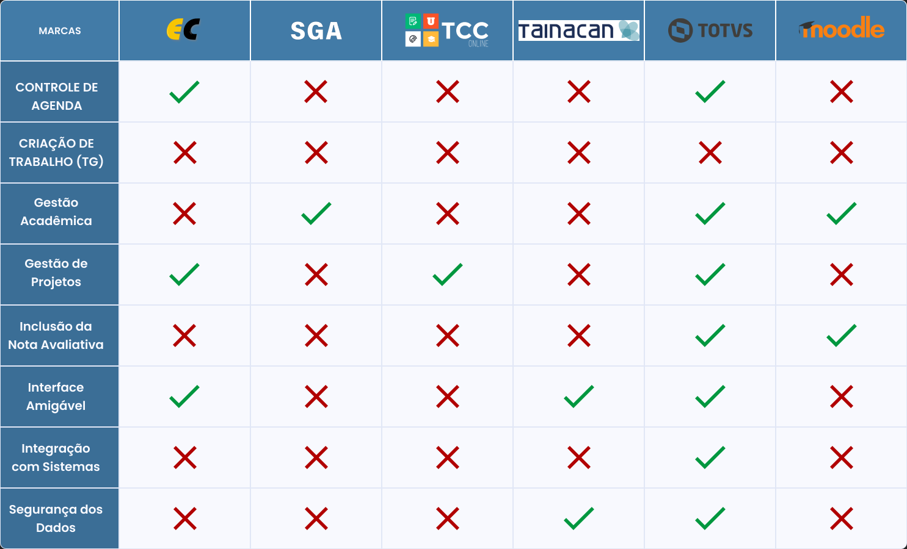
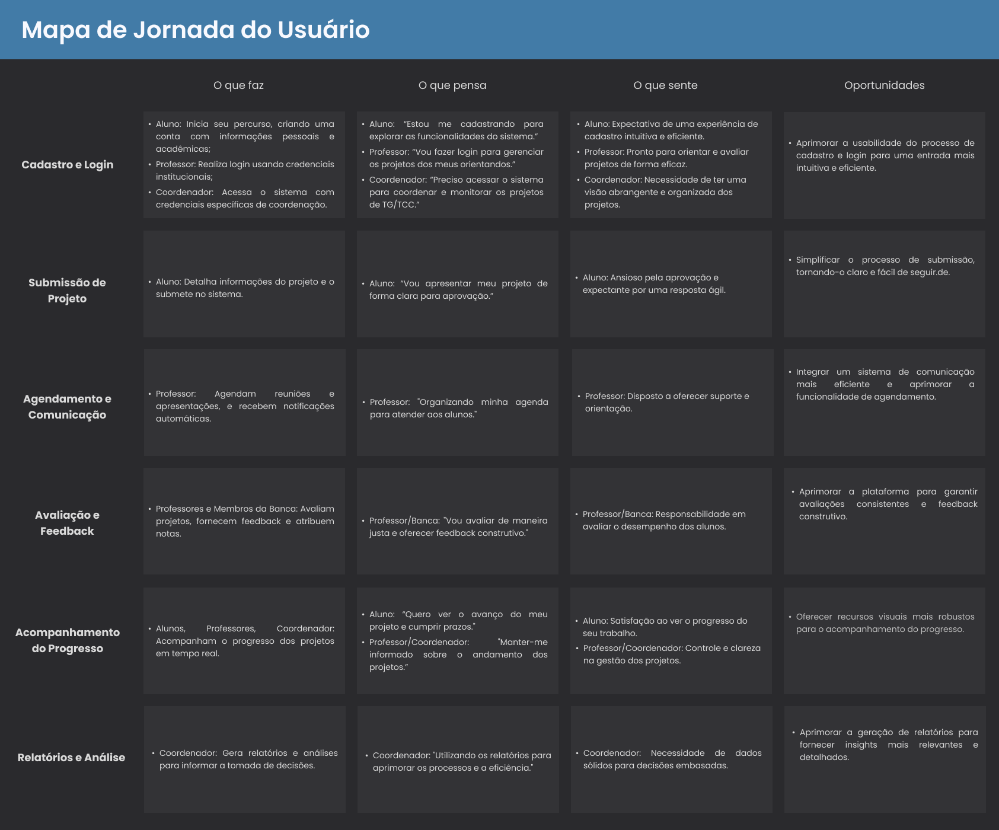

<br id="topo">

# Sistema de Gerenciamento de Trabalhos de Graduação 

<p align="">
    <a href="#briefing">Briefing</a>  |     
    <a href="#plano5W1H">Plano 5W1H</a>  |  
    <a href="#personas">Personas</a>  |  
    <a href="#suposicoes_hipoteses-validacao">Suposições,Hipóteses e Validação</a>  | 
    <a href="#benchmark">Benchmark</a>  | 
    <a href="#mapaJornada">Mapa de Jornada de Usuário</a>  |   
    <a href="#rabiscoframes">Rabiscoframes</a>  |   
    <a href="#wireframes">Wireframes</a>  |   
    <a href="#styleguide">Styleguide</a>  |   
    <a href="#prototipo">Protótipo de Alta Fidelidade</a>  |   
    <a href="#avaliacaoHeuristica">Avaliação Heurística</a>  |  
    <a href="#membros">Membros do Grupo</a>   
</p>


<span id="briefing">

## 1. Briefing 

- Problema
```
A complexidade e a falta de eficiência no processo de acompanhamento e avaliação dos Trabalhos de Graduação (TG).
```


<span id="plano5W1H">

## 2. Plano 5W1H 


<span id="personas">

## 3. Personas


<span id="suposicoes_hipoteses-validacao">

## 4. Suposições - Hipóteses - Validação 

### Suposições

### Hipóteses

### Validação


<span id="benchmark">

## 5. Benchmark 



<span id="mapaJornada">

## 6. Mapa de Jornadas de Usuários 



<span id="rabiscoframes">

## 7. Rabiscoframes 


<span id="wireframes">

## 8. Wireframes 


<span id="styleguide">

## 9. Styleguide 


<span id="prototipo">

## 10. Protótipo de Alta Fidelidade 

[Protótipo de alta fidelidade no Figma](https://link-do-protótipo)

<span id="avaliacaoHeuristica">

## 11. Avaliação Heurística 

[Avaliação Heurística](https://link-da-avaliaçãoHeurística)

<span id="membros">

## Membros do grupo

Projeto realizado pelos alunos:

| Nome                    | LinkedIn & GitHub |
| :-----------------------| :---------------------------------------------------------------------------------------------------------------------------------------------------------------------------------------------------------------------------------------------------------------------------: | 
| Leonardo Alves Costa    | []() [](https://github.com/leonardoalvescosta) |    
| Gabriel Vinicius Pagnan    | [](https://www.linkedin.com/in/gabriel-pagnan00) [](https://github.com/Gabriel-pagnan) |    
| Rafael Cesar Ferreira   | [](https://www.linkedin.com/in/rafael-cesar-ferreira-3894b8231/) [](https://github.com/rafaelcf00) |    
| Rafael Malaquias Chioca | [](https://www.linkedin.com/in/rafaelchioca/) [](https://github.com/rafaelchioca) |


→ [Voltar ao topo](#topo)
