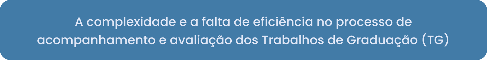
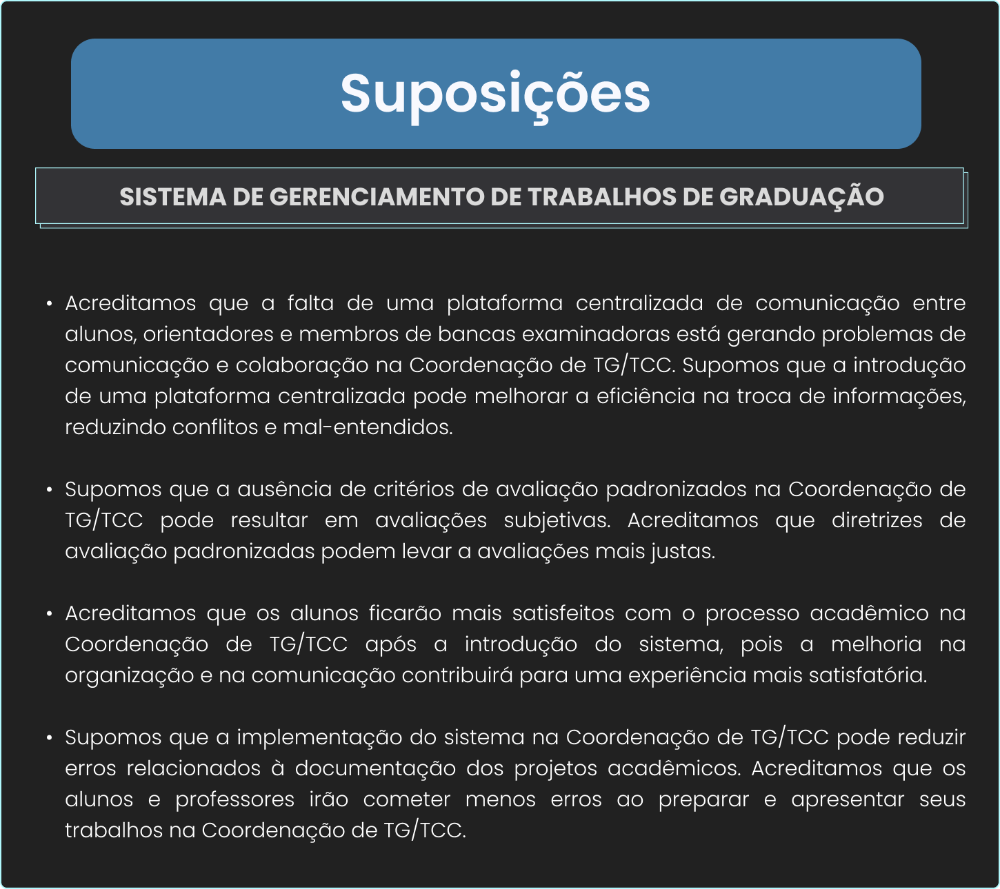

 

# Sistema de Gerenciamento de Trabalhos de Graduação 

    <a href="#briefing">Briefing</a>  |     
    <a href="#plano5W1H">Plano 5W1H</a>  |  
    <a href="#personas">Personas</a>  |  
    <a href="#suposicoes_hipoteses-validacao">Suposições,Hipóteses e Validação</a>  | 
    <a href="#benchmark">Benchmark</a>  | 
    <a href="#mapaJornada">Mapa de Jornada de Usuário</a>  |   
    <a href="#rabiscoframes">Rabiscoframes</a>  |   
    <a href="#wireframes">Wireframes</a>  |   
    <a href="#styleguide">Styleguide</a>  |   
    <a href="#prototipo">Protótipo de Alta Fidelidade</a>  |   
    <a href="#avaliacaoHeuristica">Avaliação Heurística</a>  |  
    <a href="#membros">Membros do Grupo</a>   

## 1. Briefing 

- Problema: 

 
 
 
   Como coordenador de curso em uma instituição de ensino, enfrento desafios significativos na gestão dos Trabalhos de Conclusão de Curso (TCC), Trabalhos de Graduação (TG) e Projetos Integradores (PI). Atualmente, os processos manuais de coleta de informações, agendamento de bancas e registro de notas consomem considerável tempo e são propensos a erros.
   
   A necessidade de acompanhar vários projetos simultaneamente, envolvendo alunos de diferentes níveis acadêmicos, torna desafiador atribuir orientadores de forma eficiente, considerando a disponibilidade de cada professor.
   
   Ao buscar ferramentas que pudessem otimizar o acompanhamento do progresso dos alunos e facilitar a comunicação entre os envolvidos, constatei a ausência de uma solução digital dedicada ao processo de gestão de trabalhos acadêmicos. Essa lacuna compromete a eficiência do processo, impactando a coordenação de orientadores, a atribuição eficiente de projetos e a transparência no gerenciamento de TG/TCC.

- História do usuário: 

    Como coordenador de curso, atualmente, lido com processos manuais demorados e propensos a erros, especialmente na coleta de informações, no agendamento de bancas e no registro de notas.

    Quero uma ferramenta que me permita acompanhar eficientemente o progresso de vários projetos simultaneamente, independentemente do nível acadêmico dos alunos. Além disso, busco otimizar o processo de atribuição de orientadores, considerando a disponibilidade de cada professor.

    Ao utilizar a solução, espero poder cadastrar facilmente projetos, registrar informações cruciais e agendar reuniões e apresentações de forma intuitiva. Desejo que o sistema facilite a comunicação entre alunos, orientadores e membros de bancas examinadoras, enviando notificações automáticas para todos os envolvidos.

    Gostaria de ter uma visão em tempo real do progresso dos projetos, permitindo-me identificar marcos atingidos e garantir que os prazos sejam cumpridos. Além disso, espero que a solução forneça relatórios e análises que me auxiliem na tomada de decisões e na melhoria contínua do processo de gestão de TG/TCC.

    Como resultado, pretendo coordenar orientadores de forma mais eficiente, reduzir o tempo gasto em processos manuais, implementar uma ferramenta digital integrada para acompanhamento do progresso dos alunos e fortalecer a reputação acadêmica da instituição. Desejo proporcionar uma melhor experiência aos alunos e aumentar a satisfação dos professores orientadores.

- Atores: 

    1. Alunos: Envolvidos na elaboração e execução de Trabalhos de Graduação (TG), Trabalhos de Conclusão de Curso (TCC) e Projetos Integradores (PI);

    2. Professores orientadores: Responsáveis por orientar e avaliar os projetos dos alunos, contribuindo para o desenvolvimento acadêmico;

    3. Membros de bancas examinadoras: Participam da avaliação final dos trabalhos apresentados pelos alunos, atribuindo notas e fornecendo feedback;
    
    4. Coordenadores de TG/TCC: Encarregados da coordenação geral, gerenciamento eficiente de orientadores, e supervisão do andamento dos projetos de TG/TCC em diferentes semestres e modalidades de ensino.

- Processos:

    - Coleta de Informações Iniciais: Este processo envolve a coleta inicial de informações por parte dos alunos, que registram dados essenciais sobre seus projetos, tais como título, equipe, objetivos e cronograma. Essa etapa é crucial para o início do ciclo do trabalho.

    - Atribuição de Orientadores: Com base nas informações fornecidas pelos alunos, ocorre a atribuição eficiente de professores orientadores. Esse processo considera a disponibilidade de cada professor, garantindo uma distribuição equitativa dos projetos entre os orientadores.

    - Agendamento de Reuniões e Apresentações: Alunos e professores orientadores utilizam a plataforma para agendar reuniões, apresentações e outras atividades relacionadas aos projetos. O sistema automatiza notificações, garantindo eficiência na comunicação.

    - Avaliação de Projetos: Professores orientadores e membros de bancas examinadoras utilizam a plataforma para atribuir notas, fornecer feedback construtivo e registrar observações sobre os projetos dos alunos. Esse processo é essencial para a avaliação crítica do trabalho realizado.

    - Acompanhamento Contínuo: Todos os envolvidos têm acesso contínuo e em tempo real ao andamento dos projetos. O sistema fornece uma visão abrangente dos marcos alcançados, prazos e outras atualizações relevantes, promovendo a transparência e a eficiência no acompanhamento.

    - Geração de Relatórios e Análises: O sistema gera relatórios e análises detalhados, fornecendo insights valiosos para a tomada de decisões e promovendo melhorias contínuas nos processos de gestão de TG/TCC ao longo do tempo.

- Dados:

  Neste estágio inicial, é prematuro definir detalhes específicos sobre os dados, uma vez que a solução ainda está em fase de concepção e não há uma visão clara dos atributos necessários. Entendemos que, ao definir características detalhadas dos dados neste momento, correríamos o risco de incorrer em equívocos.

  Portanto, a abordagem neste ponto é considerar que os dados relevantes para o efetivo funcionamento da solução serão identificados de maneira mais precisa durante as fases posteriores do desenvolvimento, quando uma compreensão mais profunda dos processos e requisitos específicos for alcançada.

  As futuras iterações deste projeto se concentrarão em uma análise mais detalhada dos tipos de dados necessários, estruturas de banco de dados apropriadas e considerações sobre privacidade e segurança da informação, garantindo uma abordagem mais assertiva e alinhada às reais necessidades dos usuários e do sistema.

- Resultados:

    - Melhoria na coordenação de orientadores e atribuição eficiente de projetos;

    - Redução do tempo gasto em processos manuais, aumentando a eficiência;

    - Implementação de uma ferramenta digital integrada para acompanhamento do progresso dos alunos;

    - Sincronização eficiente de atividades;

    - Facilitação da comunicação entre alunos, orientadores e coordenadores;

    - Maior transparência e controle no processo de gestão de TG/TCC;

    - Melhor experiência dos alunos;

    - Maior satisfação dos professores orientadores;

    - Fortalecimento da reputação acadêmica da instituição.

## 2. Plano 5W1H 

  Why - O Coordenador de TG/TCC enfrenta desafios significativos devido à falta de ferramentas eficientes para gerenciar, coordenar e avaliar os Trabalhos de Graduação. Essa falta de um sistema adequado impacta negativamente na experiência dos alunos e na eficácia dos professores orientadores.

  Who - Os principais envolvidos são alunos de graduação, professores orientadores, membros das bancas examinadoras e, especialmente, o Coordenador de TG/TCC, que é o Product Owner (PO) para quem a solução deve ser desenvolvida.

  When - O problema persiste ao longo de todos os semestres acadêmicos, pois os Trabalhos de Graduação são uma constante em cada período letivo.

  Where - O foco está na instituição de ensino superior como um todo, considerando todos os departamentos e cursos que envolvem Trabalhos de Graduação.

  What – Os desafios concentram-se na coordenação, comunicação e avaliação dos projetos acadêmicos. Isso inclui a falta de um sistema eficiente de gerenciamento, resultando em atrasos, erros de comunicação e uma avaliação menos transparente e padronizada dos Trabalhos de Graduação. Esses obstáculos prejudicam a experiência dos alunos e a capacidade dos professores orientadores de fornecer orientação de alta qualidade.

  How - O problema ...

## 3. Personas

 

 

 

 

## 4. Suposições - Hipóteses - Validação 

### Suposições

### Hipóteses

### Validação
    

## 5. Benchmark 

## 6. Mapa de Jornadas de Usuários 

## 7. Rabiscoframes 

## 8. Wireframes 

## 9. Styleguide 

## 10. Protótipo de Alta Fidelidade 

[Protótipo de alta fidelidade no Figma](https://link-do-protótipo)

## 11. Avaliação Heurística 

[Avaliação Heurística](https://link-da-avaliaçãoHeurística)

## Membros do grupo

Projeto realizado pelos alunos:

| Nome                    | LinkedIn & GitHub |
| :-----------------------| :---------------------------------------------------------------------------------------------------------------------------------------------------------------------------------------------------------------------------------------------------------------------------: | 
| Leonardo Alves Costa    |   |    
| Gabriel Vinicius Pagnan    |   |    
| Rafael Cesar Ferreira   |   |    
| Rafael Malaquias Chioca |   |

→ [Voltar ao topo](#topo)
